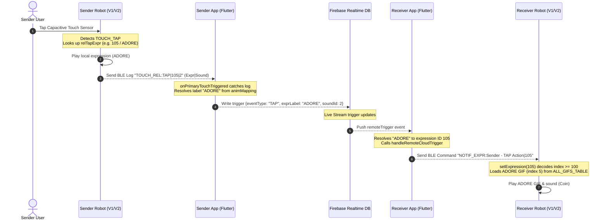

# 🌙 Mr.&Ms Luna: Interactive Desktop Companion Robots

Welcome to the official repository for **Mr. Luna** and **Ms. Luna**, a pair of smart, expressive, and connected desktop companion robots designed to bridge communication, display notifications, and bring dynamic animations to your workspace.

---

## 🚀 System Architecture & Interaction Flow

Mr.&Ms Luna utilizes a hybrid communication network comprising **Bluetooth Low Energy (BLE)** for local phone-to-robot communication and **Google Firebase Realtime Database** for internet-wide matchmaking and remote synchronization.

### 🌐 End-to-End Remote Gesture Playback Flow

The diagram below details the entire data journey when a user interacts with their local robot (Sender) and triggers a synced expression on their partner's robot (Receiver).



---

## 🌟 Core Features & Functional Logic

### 1. Google Firebase Authentication & Live Matchmaking
*   **Startup Login Screen:** Secure login/registration screen on app startup utilizing Google Firebase Auth.
*   **Live User Discovery:** Real-time online user directory allowing users to search by email, send/accept/decline invites, and pair their desktop companions.

### 2. Snapchat-Style Daily Streaks (`🔥`)
*   **Streak Tracker:** Interacting with your paired companion daily increments your streak.
*   **Streak Reset Protection:** The streak value is synchronized directly in the Firebase Database under the `friends` nodes and renders dynamically with a `🔥` badge in the dashboard.

### 3. Master GIF Library (63 Custom Animations)
*   **Bitmap Arrays:** Inside `mochi_bitmaps.h`, 63 high-fidelity bitmap sequences are stored in `PROGMEM` (`ALL_GIFS_TABLE`).
*   **App Seeding:** The companion Flutter app loads this list alphabetically via `DatabaseService.animMapping` keys.
*   **Categories & Sounds:** Custom animations (e.g., `"adore"`, `"furious"`, `"giggle"`) are mapped to default sound indexes (0 to 10).

### 4. Custom Gesture Touch Mapping
*   **Capacitive Gestures:** Supports **Single Tap**, **Double Tap**, **Triple Tap**, and **Long Press**.
*   **Offline/Standalone Settings:** If not paired, the app configures local options (e.g. show clock, cycle animations).
*   **Couple/Friends Settings:** When paired, the app configures relationship tap sequences that sync expression IDs to the local robot via BLE.

### 5. VoIP Intercom & Local Library Audio Streaming
*   **Voice Call (VoIP/BLE):** Establish standard VoIP calls directly between the phone and the robot over local network socket connection.
*   **Local Library Popup:** Search, scan, and list MP3 and WAV files on your phone via a clean, glassmorphic popup dialog. Easily stream selected tracks directly to the robot over BLE.
*   **Music Controls:** Interactive volume slider, bass adjustment slider, playback position seek bar, and play/pause/stop buttons live-update the streaming state.
*   **Hardware Loopback Test:** Quickly diagnose audio capture and playback latency by running an echo loopback test on the robot.

---

## 🛠️ Hardware & Firmware Architectures

| Feature | Version 1 (`luna_firmware/`) | Version 2 (`luna_firmware_v2/`) |
| :--- | :--- | :--- |
| **Microcontroller** | ESP32-C3 (SuperMini) | ESP32-S3 (LOLIN S3 Mini) |
| **Display Support** | SSD1306 OLED (128x64) | Premium Smartwatch UI (SH1106/SSD1306) |
| **UI Screens** | Companion Eyes Face, Clock, Text Scroll | Face, Calendar Grid, Google Maps, Notifications, Clock Styles, settings |
| **Buzzer Melodies** | Non-blocking Piezo Synthesizer | Non-blocking Piezo Synthesizer |
| **Pairing Intercept** | Prevents clock screen switch on active pairing | Prevents clock screen switch on active pairing |
| **VoIP / Audio Stream** | Local Audio playback support | PCM audio buffer streaming, volume & bass controls |

---

## 📂 Project Organization

Unwanted test files and duplicates have been cleaned up to maintain a clean project root:

```
├── luna_firmware/         # C++ Arduino firmware for ESP32-C3 (V1)
│   ├── luna_firmware.ino  # Main hardware routine (BLE, touch, buzzer)
│   ├── expressions.h      # Procedural & master GIF rendering face classes
│   └── mochi_bitmaps.h    # 63 custom PROGMEM bitmap tables
│
├── luna_firmware_v2/      # Smartwatch UI C++ Arduino firmware for ESP32-S3 (V2)
│   ├── luna_firmware_v2.ino
│   ├── expressions.h      # Includes notification, calendar, and map drawers
│   └── mochi_bitmaps.h
│
├── mobile_flutter/        # Flutter Cross-Platform App
│   ├── lib/screens/       # login_startup, main_dashboard, matchmaking screens
│   ├── lib/services/      # firebase_service, bluetooth_service, database_service
│   └── pubspec.yaml
│
├── analyze_gifs.py        # Extracts timing metadata from raw GIF assets
├── convert_mochi_gifs.py  # Converts raw GIF animations into C++ PROGMEM byte arrays
├── flash_server.py        # Web-based local flashing server (serves flash_dashboard)
├── flash_tool.py          # Command line serial programmer utility
└── README.md              # This documentation!
```

---

## ⚡ Quick-Start Guide (Compilation & Flashing)

Ensure you have the `arduino-cli` utility installed and configured.

### 1. Flash Version 1 (ESP32-C3)
Compile and upload with the custom partition scheme `huge_app` to accommodate the 63 high-fidelity bitmap assets:

```powershell
# Compile sketch
arduino-cli compile --fqbn esp32:esp32:esp32c3:PartitionScheme=huge_app,CDCOnBoot=cdc luna_firmware

# Upload/Flash to COM port
arduino-cli upload -p COM6 --fqbn esp32:esp32:esp32c3:PartitionScheme=huge_app,CDCOnBoot=cdc luna_firmware
```

### 2. Flash Version 2 (ESP32-S3)
Compile and upload to the ESP32-S3 smartwatch board:

```powershell
# Compile sketch
arduino-cli compile --fqbn esp32:esp32:lolin_s3_mini:PartitionScheme=huge_app,CDCOnBoot=cdc luna_firmware_v2

# Upload/Flash to COM port
arduino-cli upload -p COM9 --fqbn esp32:esp32:lolin_s3_mini:PartitionScheme=huge_app,CDCOnBoot=cdc luna_firmware_v2
```

> [!IMPORTANT]
> Both firmware versions utilize `PartitionScheme=huge_app` configuration. Standard partition mapping will fail compilation due to binary sizes.

---

*Enjoy interacting with Mr.&Ms Luna! 🌙✨*